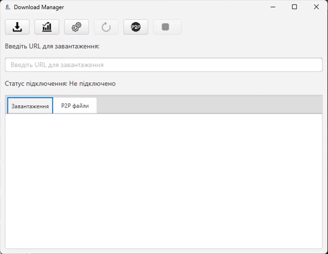
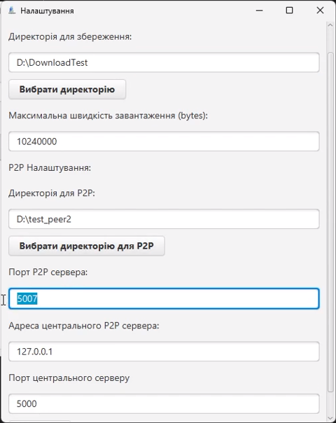
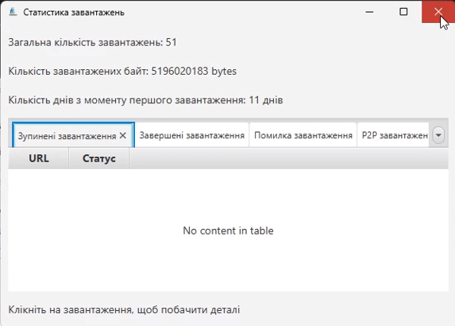

# DownloadManager

A desktop application for managing file downloads and sharing files via a peer-to-peer network.


## 📖 Table of Contents
- [Overview](#overview)
- [Key Features](#key-features)
- [Tech Stack](#tech-stack)
- [Quick Start](#quick-start)
- [Screenshots](#screenshots)

## 🔎 Overview

The application provides users with a centralized tool to manage file downloads, control bandwidth usage, and maintain a history of their network activity. It is designed for individuals who require detailed oversight of their downloads and want to integrate a desktop download manager directly with their web browser.

The system incorporates a custom speed distribution algorithm that dynamically allocates bandwidth among active downloads based on a global limit. It features a built-in local HTTP server to receive download commands directly from browser extensions. The architecture relies on structural design patterns such as Observer for UI updates, Command for actions, and a Template Method for the download lifecycle.

Users initiate downloads by pasting a URL into the application or by clicking a file link in their browser via the included extension. Once started, they view real-time progress, and can pause, resume, or cancel downloads from the main dashboard. Users can also connect to a central P2P server to discover and download files directly from other connected peers.

## ⭐ Key Features

- **Browser Integration** — Receives download links directly from Chrome and Mozilla extensions via a local HTTP server listening on port 8080.
- **Dynamic Speed Allocation** — Distributes the configured global bandwidth limit across all active downloads to prevent complete network congestion.
- **Peer-to-Peer File Sharing** — Allows clients to register shared files with a central server and download files directly from other peers.
- **Resumable Downloads** — Uses HTTP Range requests to pause and resume file transfers without losing downloaded byte progress.
- **Statistics Tracking** — Records and persists download metrics, including total data size and operation times, to a local SQLite database.

## 🛠 Tech Stack

*   **Backend / Core**
    *   **Java 17** — Core application logic and object-oriented design implementation.
    *   **JavaFX 21.0.4** — Graphical user interface rendering and event handling.
    *   **SQLite JDBC 3.47.1.0** — Local relational database for storing file history and statistics.
    *   **Jakarta Persistence API 3.2.0** — Object-relational mapping interface for database entities.
    *   **Lombok 1.18.36** — Boilerplate reduction for data transfer objects and entities.

*   **Frontend / Extensions**
    *   **JavaScript** — Content and background scripts for the Chrome and Mozilla browser extensions.
    *   **HTML/CSS** — Structure and styling for the browser extension popup interface.

## 🚀 Quick Start

### Prerequisites
- Java Development Kit (JDK) 17
- Maven 3.x

### Setup
```bash
git clone https://github.com/DownloadManagerProject/DownloadManager.git
cd DownloadManager
```

### Run
```bash
mvn clean javafx:run
```

| Service | URL | Description |
|---|---|---|
| Extension API | `http://localhost:8080/api/download/add` | HTTP server for receiving URLs from browser extensions |
| Central P2P Server | `localhost:5000` | Discovery server for the peer-to-peer network |

## 📸 Screenshots

<p align="center">
  
  
</p>
<p align="center">
  <em>Main Dashboard</em>&nbsp;&nbsp;&nbsp;&nbsp;&nbsp;&nbsp;&nbsp;&nbsp;&nbsp;&nbsp;&nbsp;&nbsp;&nbsp;&nbsp;&nbsp;&nbsp;&nbsp;&nbsp;&nbsp;&nbsp;&nbsp;&nbsp;&nbsp;&nbsp;&nbsp;&nbsp;&nbsp;&nbsp;&nbsp;&nbsp;
  <em>P2P File Sharing</em>
</p>
<p align="center">
  
</p>
<p align="center">
  <em>Statistics Dashboard</em>
</p>
